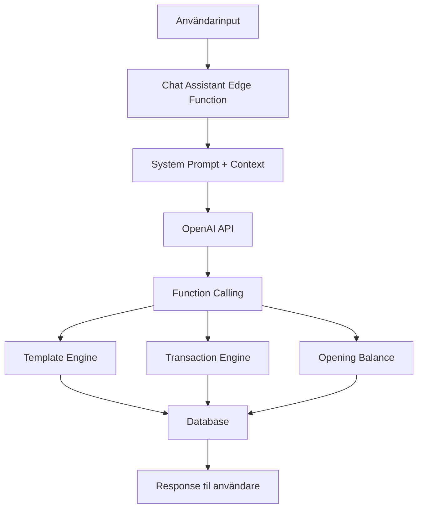

# AI-systemdesign - AirLedger AI

## Översikt

AirLedger AI använder OpenAI:s GPT-modeller med Function Calling för att skapa en intelligent bokföringsassistent som förstår naturligt språk och utför strukturerade bokföringsoperationer.

## AI-arkitektur

### Systemkomponenter



## System Prompt Design

### Kärnprinciper
Vår system prompt följer dessa viktiga principer:

1. **Mallbaserad kontering**: AI:n får ALDRIG föreslå specifika kontonummer
2. **Single Source of Truth**: Alla konteringsförslag kommer från mallar
3. **Transparent process**: AI:n visar alltid mallens poster innan bokföring
4. **Dubblettskydd**: Samma transaktion skapas bara EN gång per förfrågan

### Prompt-struktur
```
1. Huvudfunktioner och roller
2. Kritiska regler (dublettskydd, mallbaserat arbetsflöde)
3. Språkförståelse (transaktionsriktning)
4. Funktionsval baserat på scenario
5. Svenskt bokföringssystem
6. Datum- och beloppshantering
7. Transparent mallhantering
8. Svarsformat och stil
```

## Function Calling System

### Tillgängliga Funktioner

#### 1. `use_transaction_template`
**Syfte**: Huvudfunktion för vanliga transaktioner
**När**: Hyra, el, telefon, försäkringar, löner, etc.
**Process**:
1. AI identifierar lämplig mall
2. Hämtar mallstruktur från databas
3. Visar exakta poster för användaren
4. Bekräftar innan bokföring

#### 2. `save_opening_balance`
**Syfte**: Ingående balanser
**När**: "Saldo på konto", "ingående balans", etc.
**Kräver**: Kontonummer (enda undantaget från mallregeln)

#### 3. `save_general_transaction`
**Syfte**: Komplexa transaktioner utan befintlig mall
**När**: Ovanliga eller specifika bokföringsposter
**Process**: Manuell kontering med validering

### Function Call Flow

```typescript
// Exempel på function call-process
1. Användarinput: "Betalat hyra 8000 kr"

2. AI analys:
   - Identifierar: Kostnadstransaktion
   - Kategoriserar: Lokalhyra
   - Väljer mall: "Lokalhyra"

3. Mall-hämtning:
   - Hämtar mallstruktur från databas
   - Visar poster: Debet 5010, Kredit 1930

4. Bekräftelse:
   - Presenterar för användaren
   - Väntar på godkännande

5. Exekvering:
   - Anropar use_transaction_template
   - Skapar transaktion
   - Uppdaterar statistik
```

## Språkförståelse och NLP

### Kritisk Riktningsförståelse

AI:n måste korrekt identifiera transaktionsriktning:

**INKÖP (företaget köper)**:
- "Fått faktura från [leverantör]"
- "Betalat [leverantör]"
- "Köpt från [leverantör]"

**FÖRSÄLJNING (företaget säljer)**:
- "Skickat faktura till [kund]"
- "Fakturerat [kund]"
- "Fått betalning från [kund]"

### Kontextuell Förståelse

```typescript
// Exempel på kontextuell analys
Input: "Telia faktura 1250 kr"
Analysis: {
  vendor: "Telia",
  amount: 1250,
  type: "purchase", // Vi köper från Telia
  category: "telekommunikation",
  suggested_template: "Telekommunikation"
}
```

## Mallintegration

### Template Matching Process

1. **Nyckelords-matching**: AI matchar användarinput mot template keywords
2. **Kategorisering**: Identifierar transaktionstyp och kategori
3. **Mallval**: Väljer mest lämplig mall från tillgängliga
4. **Validering**: Kontrollerar att vald mall är lämplig

### Template Enhancement

AI:n hjälper till att förbättra mallsystemet genom:
- **Användningsstatistik**: Spårar vilka mallar som används mest
- **Gap-identifiering**: Identifierar saknade mallar
- **Förbättringsförslag**: Föreslår nya mallar baserat på användarinteraktioner

## Felhantering och Validering

### Input Validation
- Datumformat (hanterar "1 juni" → "2025-06-01")
- Beloppsvalidering (inkl/exkl moms)
- Valutakonvertering (allt i SEK)

### Error Recovery
```typescript
// Exempel på felhantering
if (templateNotFound) {
  // Föreslå närliggande mallar
  suggestSimilarTemplates()
} else if (amountAmbiguous) {
  // Fråga om inkl/exkl moms
  askForClarification()
} else if (dateAmbiguous) {
  // Anta aktuellt år
  assumeCurrentYear()
}
```

### Consistency Checks
- Debet = Kredit för alla transaktioner
- Giltiga kontonummer enligt BAS
- Logisk transaktionsstruktur

## Prestandaoptimering

### Caching Strategies
- **Template Cache**: Mallar cachas för snabbare åtkomst
- **Context Cache**: Användarkontext sparas mellan meddelanden
- **Response Cache**: Vanliga svar cachas

### API-optimering
- **Batch Processing**: Flera operations i samma API-call
- **Selective Loading**: Laddar endast nödvändig malldata
- **Connection Pooling**: Effektiv databasåtkomst

## Övervakning och Analytics

### AI Performance Metrics
- **Response Time**: Tid från input till svar
- **Accuracy Rate**: Korrekthet i template-val
- **User Satisfaction**: Feedback från användare
- **Template Usage**: Statistik över mallanvändning

### Quality Assurance
- **Template Validation**: Kontrollerar mallkonsistens
- **Response Quality**: Övervakar AI-svarstkvalitet
- **Error Tracking**: Spårar och analyserar fel

Detta designsystem säkerställer att AI:n fungerar pålitligt, konsistent och i linje med svensk redovisningssed.
